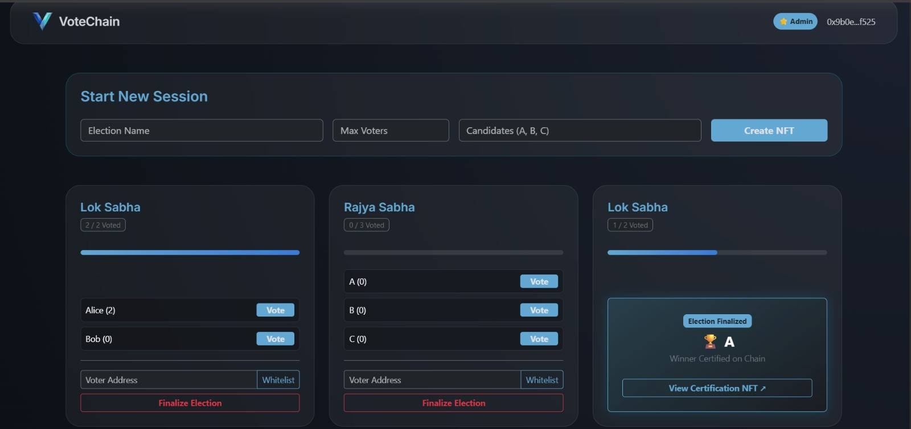
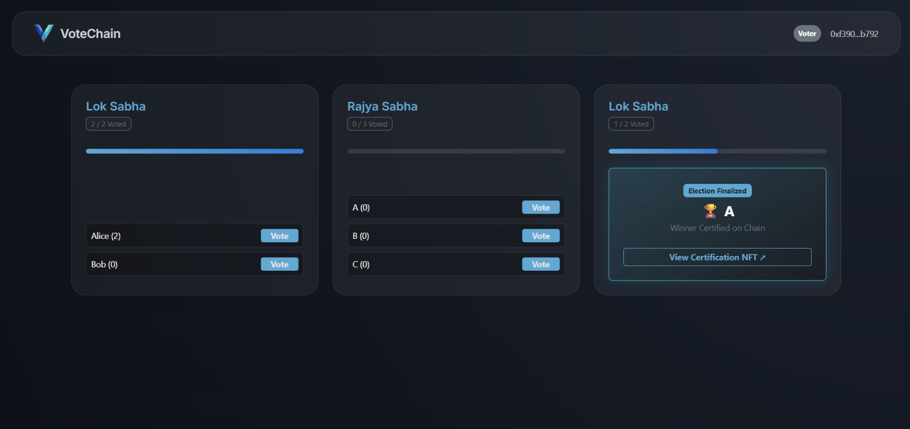
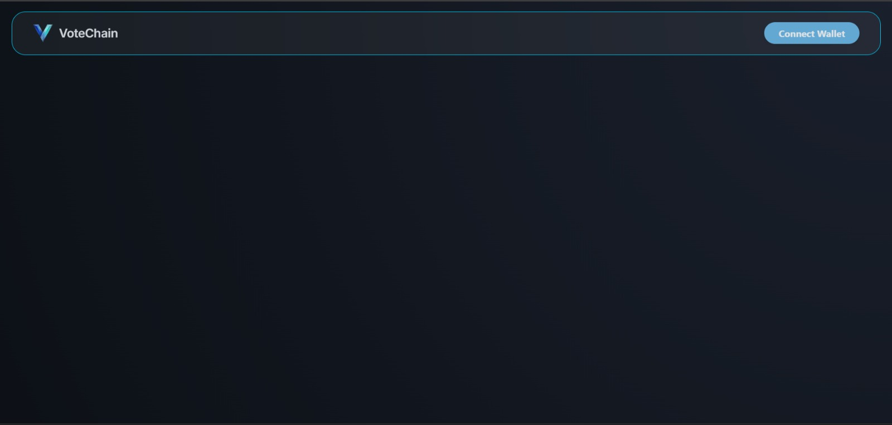

# VoteChain

**VoteChain** is a decentralized voting application (dApp) built on **Base Sepolia**. It replaces traditional centralized voting with a transparent, immutable blockchain-based system using a Factory Pattern architecture.
Live at: https://vote-chain-tawny.vercel.app/

---

##  Tech Stack
* **Frontend:** React.js, Vite, Bootstrap 
* **Blockchain:** Solidity, Ethers.js, Base Sepolia Testnet
* **Smart Contracts:** Factory-Session Architecture (deployed via Remix)

---

## How to Use
**For Admins:**
* **Wallet Connection:** Connect your crypto wallet (MetaMask recommended) using the "Connect Wallet" button.
* **Launch Election:** Enter the election name, maximum voter capacity, and candidate names. Click **"Create NFT"** to deploy the session. This mints a unique digital asset that serves as an immutable public receipt
* **Voter Authorization:** Whitelist the wallet ids of the voters, so only those selected voters will be able to cast a vote
* **Finalize and certify:** Once voting is complete, click **"Finalize Election"**. This executes the winner-selection logic on-chain and permanently declares the result.

**For Users:**
* **Eligibility:** Ensure your wallet address has been whitelisted by the election administrator.
* **Authentication:** Connect your wallet to the platform.
* **Cast Vote:** Eligible elections will appear on your dashboard. Select your preferred candidate to submit your vote. **Note:** Transactions are final and limited to one vote per whitelisted address.

---

##  Final Product

  

| **Admin Dashboard** | **Voter Interface** | **Home Page** |
| :--- | :--- | :--- |
|  |  |  |

---

##  Key Features
* **Factory Pattern:** Every election session is its own isolated smart contract deployed by the main Factory contract.
* **Whitelisting:** Only admin-authorized addresses can cast votes (on-chain verification).
* **Finalization Logic:** Once a session ends, the winner is permanently certified and the state is locked.

---

##  Development

1. **Install:** `npm install`
2. **Run:** `npm run dev`
3. **Network:** Connect MetaMask to **Base Sepolia**.
